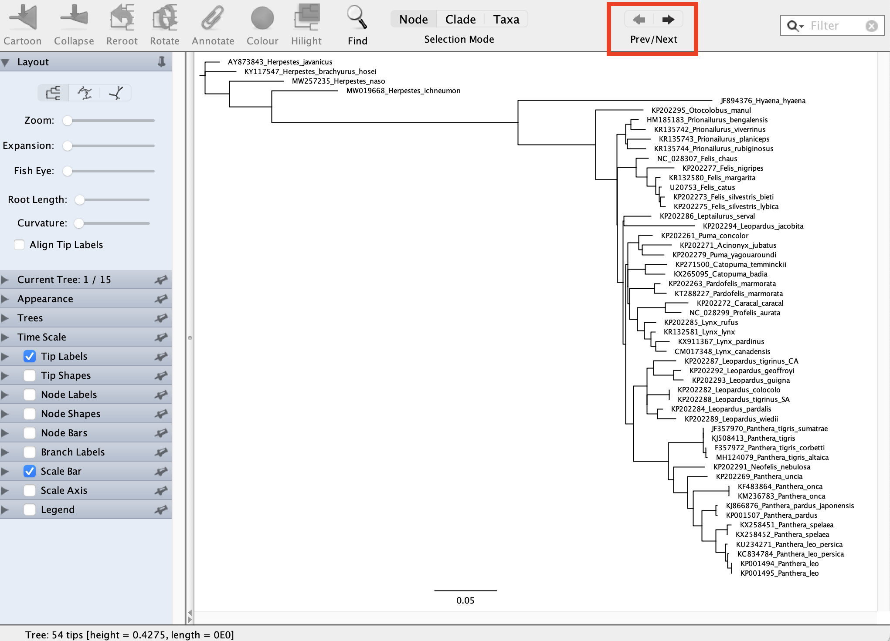

# Gene tree summary methods

It is quite often observed that phylogenetic relationships inferred from single genes differ from the tree that is inferred using all the available data. Sometimes this is simply due to the single genes not having enough phylogenetic signal, and thus they cannot resolve the relationships in question. But there are also biological reasons why this could happen, of which two are well studied. The first is Incomplete Lineage Sorting (ILS), which basically means that gene polymorphisms in ancestral populations are carried over to the descendant species. This in turn means that some haplotypes in one species will be more related to haplotypes in another species than to other haplotypes in the same species. The second biological reason that can lead to so-called gene tree/species tree conflicts is hybridization (also called introgression or horizontal transfer). 

Various methods have been developed to investigate these patterns. We will use [ASTRAL-IV](https://github.com/chaoszhang/ASTER/blob/master/tutorial/astral4.md), the newest edition of the program ASTRAL, which is consistent under the multi-species coalescent method. This program is part of the Accurate Species Tree EstimatoR (ASTER❋). You can download the package from its [GitHub repository](https://github.com/chaoszhang/ASTER?tab=readme-ov-file). ASTRAL attempts to find the species tree that agrees with the largest number of quartet trees induced by the set of gene trees.

ASTRAL-IV is a commandline driven program, but works very simply. The input file is a file with all the gene trees that one is interested in, so to do an ASTRAL analysis, we first need to generate gene trees. This can be done with IQ-TREE or MrBayes, or any other program that can generate a phylogenetic tree from DNA data. In principle one could do this one by one for each gene, but that would be tedious if one has a large number of genes (e.g. 100s or 1000s of genes). Fortunately, IQ-TREE has a command that will do this for you automatically, either based on a folder with the individual genes in separate files (Fasta or Phylip format), or based on a concatenated dataset and a gene partition file. 

As the four genes we have been working with are too few to do a proper ASTRAL analysis, we are providing you with alignments of the other 9 protein coding genes and two ribosomal genes. You can find all 15 genes [here](../../Data/input_for_astral) as separate Phylip formatted files. In your working directory, create a folder called `FelidaeMtgenes` and copy the 15 Phylip files to that folder. Estimating the gene trees is very easy, you just run the command

```
iqtree -S FelidaeMtgenes --prefix Felidaeloci -T AUTO
```
or this one if you're running this on your own computer

```
./iqtree2 -S FelidaeMtgenes --prefix Felidaeloci -T AUTO
```

After a couple of minutes you should have a number of files with the name `Felidaeloci.*`. The file we are interested in is `Felidaeloci.treefile`, which should have 15 trees in it (one tree for each gene). You can open this file in **FigTree**, and flip through the different trees by clicking on the arrows on the top right (see red rectangle below) in the program. *Do they all look like they have the same topology?* If you look very carefully, you will notice some trees are missing one or two species. This is because that particular gene was missing from the mitochondrial genome data, perhaps because the quality of the sequence was not good.

<p align="center"></p>

The next thing to do is to make sure you have the `Felidaeloci.treefile` file in your working directory. Then go to that directory in your terminal and put in the following commands:

```
astral4 -o FelidaeASTRAL.tre Felidaeloci.treefile
```

or copy the `Felidaeloci.treefile` to where you have the ASTER program installed, and run this one below **if you're running this on your own computer**

```
./astral4 -o FelidaeASTRAL.tre Felidaeloci.treefile
```

If you are a Windows user and cannot successfully run the above command, try using the `\` character instead of `/`.

The command -o is used to designate the output file, which you should name `FelidaeASTRAL.tre` and this is followed by the input file `Felidaeloci.treefile`.

Now have a look at the `FelidaeASTRAL.tre` file in **FigTree**. *Does it differ from the tree you have previously gotten when analysing concatenated data?*
<!--
**Task for the afternoon**: you can make a concatenated dataset of all 15 genes, along with a gene partition file (as you did in [Tutorial 2](../Alignments), and then analyse this dataset in IQ-TREE (as you did in [Tutorial 3](../ModelSelection) and [Tutorial 5](../MaximumLikelihood)).
--!>
