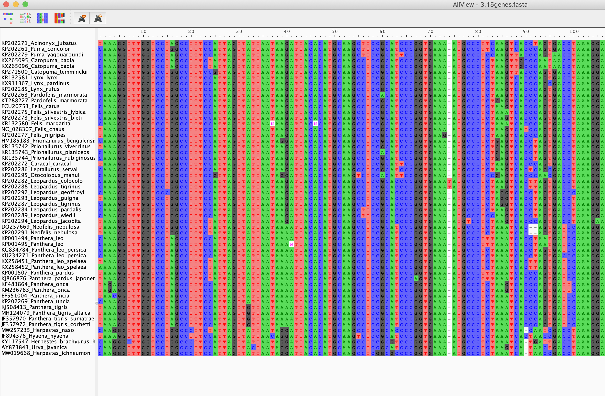

# Model Selection


In the first two tutorials you have learned to download sequences from Genbank and align and concatenate them to create a multi-gene dataset. You also heard about differences between file formats and saw how to create the needed formats. For the next tutorial, we are going to use *ModelFinder* to find the best partitioning scheme for our dataset and also the best models for each partition.

First remember that our final dataset, `ATP6_COI_CytB_ND5.phy` was formed by 4 genes and you saved it as a PHYLIP format with the extension `.phy`. Now open *Aliview* and open this file. You should have something similar to this:

<p align="center"></p>

Then from the menu, select: `File`-> `Save as Nexus` and don't change the file name when saving. You should have these two files now:

```
ATP6_COI_CytB_ND5.phy
ATP6_COI_CytB_ND5.nexus
```

For substution model selection we are going to use the `ATP6_COI_CytB_ND5.phy` and a command file that we are going to create together. 

## Choosing the right substitution model

We will use ModelFinder ([Kalyaanamoorthy et al. 2017](https://www.nature.com/articles/nmeth.4285)), as implemented in [IQ-TREE2](http://www.iqtree.org) ([Nguyen et al. 2015](https://academic.oup.com/mbe/article/32/1/268/2925592)), to determine the best-fit model. IQ-TREE2 for Windows, MacOSX and Linux can be downloaded [here](http://www.iqtree.org/#download), you can install it on your personal computer.

ModelFinder chooses the model that minimizes the BIC score (you can also change the selection criteria to AIC or AICc by adding the option -AIC or -AICc, respectively).

You will need a partition file either in NEXUS or RAxML-style formats, like the examples below: 

The RAxML-style partition file may look like:

```
 DNA, part1 = 1-69 
 DNA, part2 = 70-666
```

Nexus-style partition file may look like:

```
#nexus
begin sets;
    charset part1 = 1-69; 
    charset part2 = 70-666;
end;
```

You should have this partition file from Tutorial 2. It should be called `Gene_partitions.txt`. 

### Running ModelFinder with IQ-TREE

Once we have the parition file, we need to locate where our downloaded IQ-TREE folder (or a compressed file named like `iqtree-2.2.0-XXXX.zip`). If you have a compressed file, you should uncompress it first. Inside that folder, there should be another folder named `bin/` go to that folder.

Make sure that you have moved the data and the partition file into this folder.

Then follow the steps listed below according to your operating system.

**If you use MacOS**: You can right click (while holding the option key) that `bin` folder and select `Copy as pathname`. Then launch your Terminal app and type `cd` and paste. You should see a command-line like this:

```
cd /Users/yourName/Downloads/iqtree-2.2.0-MacOSX/bin
```
 
Of course, depending on where you have your folder, your user name, your IQ-TREE version, it will look slightly different. Then, hit enter.

**If you use Windows 11**: You can right click any empty space within the  `bin` folder and select `Open in Terminal`


Now that we located the folder, we can start using the program. We will start by typing the following command and running it by hitting enter.

```
./iqtree2 -s ATP6_COI_CytB_ND5.phy -p Gene_partitions.txt -m TESTMERGEONLY --prefix first

```

If you are a Windows user and cannot successfully run the above command, try using the `\` character instead of `/`.

Here, we are:
- selecting the best-fit model for the alignment `-s ATP6_COI_CytB_ND5.phy`,
- with its partitions (genes in this case) defined in `-p Gene_partitions.txt` file,
- by possibly merging partitions `-m TESTMERGEONLY` to reduce over-parameterization and increase model fit. 
- saving all generated files from this run to files that all have names starting with `--prefix first`.

Above settings for model selection will only consider the invariable site and Gamma rate heterogeneity. If you want to consider the FreeRate heterogeneity model too, then run:

```
./iqtree2 -s ATP6_COI_CytB_ND5.phy -p Gene_partitions.txt -m MF+MERGE --prefix second

```

As a third option, if you want to restrict your model search to only those models supported by a specific program (Mr Bayes in our case), then run:
```
./iqtree2 -s ATP6_COI_CytB_ND5.phy -p Gene_partitions.txt -m TESTMERGEONLY -mset mrbayes --prefix third

```

If you are in this section, well done! now you have several files with the selected best-fit model for our dataset.

Questions:

1. Compare the three files that you should see now that all end with `.best_scheme.nex`. These will include the estimated best partitioning schemes and the best fit models for them. Are there any differences?
